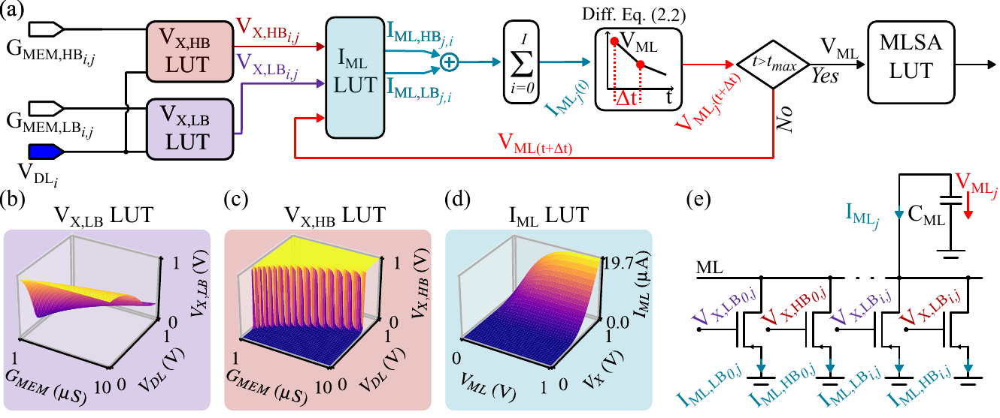
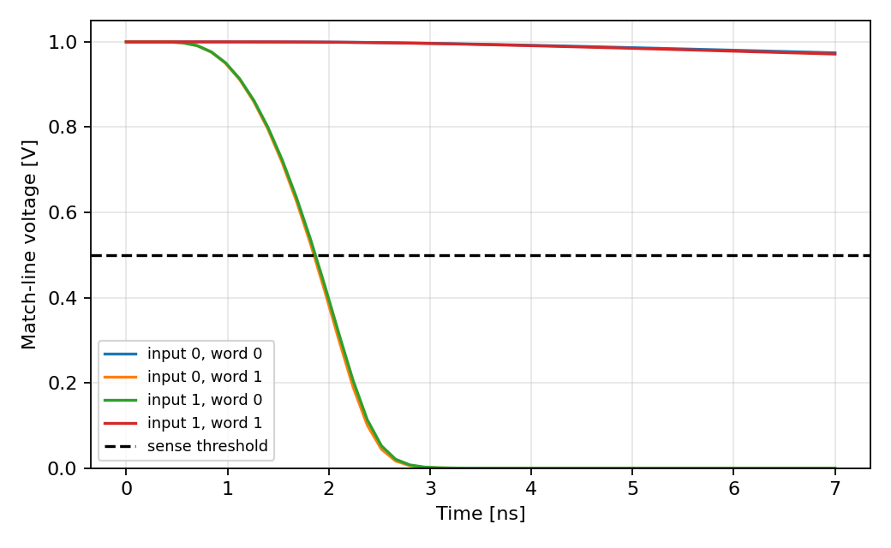
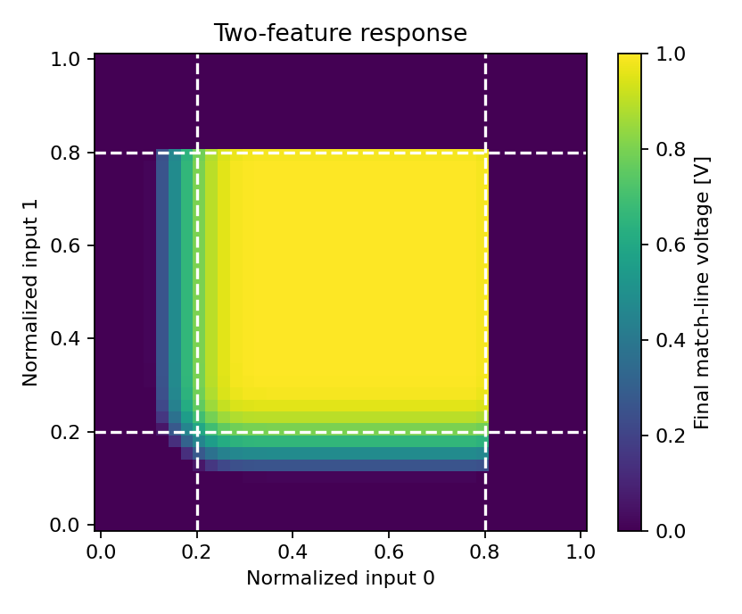

# CrossSimCAM

Fast lookup-table-based circuit simulation and crosstalk analysis for analog
content-addressable memory (aCAM) architectures.

CrossSimCAM uses SPICE-derived lookup tables to simulate the transient discharge
of shared match lines. A batch of analog input vectors can be compared against
many stored interval words in one vectorized call.



*Circuit-accurate behavioural model. The original vector figure is also
available as [PDF](figures/beh_model.pdf).*

## How the model works

CrossSimCAM is an inference-oriented, non-differentiable behavioural model for
analog NOR-type CAMs. It retains the important nonlinear circuit behaviour while
avoiding a transistor-level SPICE solve for every cell and time step. This makes
large array and classifier-inference studies practical, but the model is not
intended for gradient-based training.

The model is driven by three characteristics extracted from transistor-level
SPICE sweeps:

1. A lower-bound comparator table gives
   `V_X,LB = f(V_DL, G_MEM,LB)`.
2. An upper-bound comparator table gives
   `V_X,HB = f(V_DL, G_MEM,HB)`.
3. A pull-down table gives `I_ML = f(V_ML, V_X)` for each comparison branch.

For every query, the input data-line voltages and programmed lower/upper
conductances are broadcast across all stored words. The two comparator tables
produce the internal branch voltages. Their pull-down currents are then looked
up and summed across both bounds and all cells sharing a match line, following
Kirchhoff's current law. Because the pull-down current depends on the
instantaneous match-line voltage, the capacitor discharge is integrated in
discrete time:

```text
V_ML(t + Δt) = V_ML(t) - I_ML(t) / C_ML · Δt
```

At the end of the configured evaluation time, the match-line sense-amplifier
threshold converts `V_ML` into a digital match. A matching word retains a high
match-line voltage; one or more mismatching cells discharge their shared match
line. The included first-order transistor response (`tau_transistor`) also
approximates the finite settling time of the internal comparator nodes.

This same workflow can represent different NOR-type aCAM cells simply by
changing the SPICE-derived tables and circuit timing/capacitance parameters.
CrossSimCAM currently packages data for the 6T2M, 10T2M, and latch-based SALMC
architectures.

## Features

- Batched transient simulation of multi-feature, multi-word aCAM arrays
- Included 6T2M, 10T2M, and SALMC circuit lookup tables
- Linear, spline, and shape-preserving monotone interpolation
- Conversion from normalized interval bounds to device conductances
- Match-line voltage, current, internal-node voltage, and digital match outputs
- Portable examples without dependencies on private research code

## Installation

CrossSimCAM requires Python 3.10 or newer. From a clone of this repository:

```bash
python -m venv .venv
source .venv/bin/activate       # Windows: .venv\Scripts\activate
python -m pip install --upgrade pip
python -m pip install -e ".[examples]"
```

For development and tests, install `.[dev]` instead.

## Quick start

The input voltage array has shape `(batch, features)`. Lower- and upper-bound
conductance arrays have shape `(features, words)`.

```python
import numpy as np
from crosssimcam import ACAMModel

model = ACAMModel("6T2M", max_steps=50)

inputs = np.array([
    [0.55, 0.70],
    [0.80, 0.50],
])
lower_conductance = np.array([
    [2e-6, 5e-6],
    [3e-6, 6e-6],
])
upper_conductance = np.array([
    [7e-6, 9e-6],
    [8e-6, 9e-6],
])

result = model.simulate(inputs, lower_conductance, upper_conductance)
print(result.vml)      # final match-line voltages, shape (batch, words)
print(result.matches)  # boolean sense-amplifier decisions
```

When data and stored interval bounds are normalized to `[0, 1]`, CrossSimCAM
can perform the circuit-specific conversion:

```python
dl, gmem_lb, gmem_hb = model.encode_normalized(data, lower, upper)
result = model.simulate(dl, gmem_lb, gmem_hb)
```

Calibration happens on the first `encode_normalized` call and is cached on that
model instance.

## Examples

Run the examples from the repository root:

```bash
python examples/basic_transient.py
python examples/interval_search.py
python examples/crosstalk_map.py
```

- `basic_transient.py` plots match-line discharge over time.
- `interval_search.py` compares normalized vectors with stored interval words.
- `crosstalk_map.py` plots the joint response of two cells sharing a match line.

Plots are written to `examples/output/`, which is ignored by Git.

### Transient match-line discharge

`basic_transient.py` compares two inputs with two stored interval words. The
matching diagonal pairs retain a high `V_ML`; the mismatching off-diagonal pairs
discharge below the dashed sensing threshold.



### Multi-cell interaction and crosstalk

`crosstalk_map.py` sweeps two input features from 0 to 1 while both stored
intervals are `[0.2, 0.8]`. The plot exposes the analog response around the
ideal interval boundaries, including the combined discharge contribution of
the two cells on their shared match line.



### Interval search

`interval_search.py` demonstrates the high-level normalized-data workflow. For
the inputs and words in that script, the digital result has rows for input
vectors and columns for stored words:

```text
[[1 0]
 [0 1]
 [1 0]]
```

## Model parameters

`ACAMModel` provides circuit-specific defaults for the included architectures.
They can be overridden explicitly:

```python
model = ACAMModel(
    "10T2M",
    max_time=4e-9,
    max_steps=100,
    cell_capacitance=10e-15,
    tau_transistor=1e-9,
    sense_threshold=0.5,
)
```

`cell_capacitance` is the contribution of one CAM cell. The total match-line
capacitance is this value multiplied by the number of input features, unless
`capacitance_length` is passed to `simulate`.

Available outputs in `SimulationResult` are:

| Field | Shape | Meaning |
| --- | --- | --- |
| `time` | `(steps + 1,)` | Simulation timestamps |
| `vml_over_time` | `(batch, steps + 1, words)` | Match-line transient |
| `vml` | `(batch, words)` | Final match-line voltage |
| `matches` | `(batch, words)` | Thresholded match decisions |
| `iml` | `(batch, words)` | Final total discharge current |
| `vx_lb`, `vx_hb` | `(batch, features, words)` | Internal branch voltages |

The normalized encoder first calibrates each circuit's lower- and upper-bound
switching curves against the configured sensing threshold. It maps normalized
data to physical data-line voltages and normalized interval limits to memristor
conductances with shape-preserving interpolation. Calibration is cached per
model instance. Direct physical-voltage/conductance simulation remains
available when no normalized encoding is desired.

## Lookup-table data format

Each circuit model uses two NumPy `.npz` archives. Their basename must match the
model selected in `ACAMModel`; for example, model `6T2M` loads:

```text
6T2M_VXLBandHB.npz
6T2M_IML.npz
```

The comparator archive must contain:

| Key | Shape | Unit | Meaning |
| --- | --- | --- | --- |
| `DL` | `(n_dl,)` | V | Data-line/search-voltage sampling axis |
| `GMEM` | `(n_gmem,)` | S | Memristor-conductance sampling axis |
| `VX_LB` | `(n_dl, n_gmem)` | V | Lower-bound comparator output |
| `VX_HB` | `(n_dl, n_gmem)` | V | Upper-bound comparator output |

Thus, `VX_LB[i, j]` and `VX_HB[i, j]` are the SPICE results at
`DL[i]` and `GMEM[j]`.

The match-line pull-down archive must contain:

| Key | Shape | Unit | Meaning |
| --- | --- | --- | --- |
| `VD` | `(n_vml,)` | V | Match-line/drain-voltage sampling axis `V_ML` |
| `VG` | `(n_vx,)` | V | Pull-down gate/comparator-output axis `V_X` |
| `IML` | `(n_vml, n_vx)` | A | Match-line pull-down current |

Here, `IML[i, j]` is the SPICE current at `VD[i]` and `VG[j]`. All axes
must contain unique values; the loader sorts the axes and their tables into
ascending order. Use finite floating-point data and sample the complete
operating range expected during simulation. Queries outside these ranges are
clipped by `ACAMModel`.

A minimal writer looks like this:

```python
import numpy as np

dl = np.linspace(0.4, 1.0, 101)       # V
gmem = np.linspace(1e-6, 10e-6, 100) # S
# Arrays exported by a SPICE sweep, indexed as [DL, GMEM].
vx_lb = np.asarray(spice_vx_lb, dtype=float)
vx_hb = np.asarray(spice_vx_hb, dtype=float)
assert vx_lb.shape == vx_hb.shape == (dl.size, gmem.size)
np.savez(
    "MYMODEL_VXLBandHB.npz",
    DL=dl,
    GMEM=gmem,
    VX_LB=vx_lb,
    VX_HB=vx_hb,
)

vml = np.linspace(0.0, 1.0, 71)      # V
vx = np.linspace(0.0, 1.0, 70)       # V
# Current exported by a SPICE sweep, indexed as [VML, VX].
iml = np.asarray(spice_iml, dtype=float)
assert iml.shape == (vml.size, vx.size)
np.savez("MYMODEL_IML.npz", VD=vml, VG=vx, IML=iml)
```

To override the packaged files for an existing supported architecture, place a
correctly named pair in a directory and pass it as `data_dir`:

```python
model = ACAMModel("6T2M", data_dir="path/to/my_luts")
```

The two archives may use different axis lengths, but the voltage ranges of
`VX_LB`/`VX_HB` should overlap the `VG` range of the current table. Adding a
completely new model name currently also requires adding its transient defaults
to `MODEL_DEFAULTS` in `src/crosssimcam/model.py`.

## Testing

```bash
python -m pytest
```

## Repository layout

```text
src/crosssimcam/       Library source and packaged lookup tables
examples/              Small runnable applications
figures/               Model diagram and rendered example results
tests/                 Automated tests
pyproject.toml         Package metadata and dependencies
```

## Scope and limitations

The bundled tables are empirical circuit data and determine each model's valid
voltage and conductance ranges. CrossSimCAM clips simulation queries to those
ranges by default. It is intended for fast architecture exploration and is not
a replacement for transistor-level sign-off simulation.

## Citation

If you use CrossSimCAM or the latch-based SALMC model in academic work, please
cite:

> Paul-Philipp Manea, Aishwarya Natarajan, Jim Ignowski, John Paul Strachan,
> and Luca Buonanno, "A Fast and Energy-Efficient Latch-Based Memristive Analog
> Content-Addressable Memory," *arXiv:2605.11847*, 2026.
> [doi:10.48550/arXiv.2605.11847](https://doi.org/10.48550/arXiv.2605.11847)

```bibtex
@misc{manea2026fastenergyefficientlatchbasedmemristive,
  title         = {A Fast and Energy-Efficient Latch-Based Memristive Analog Content-Addressable Memory},
  author        = {Paul-Philipp Manea and Aishwarya Natarajan and Jim Ignowski and John Paul Strachan and Luca Buonanno},
  year          = {2026},
  eprint        = {2605.11847},
  archivePrefix = {arXiv},
  primaryClass  = {cs.ET},
  url           = {https://arxiv.org/abs/2605.11847},
  doi           = {10.48550/arXiv.2605.11847},
  booktitle     = {arXiv:2605.11847},
}
```

## License

CrossSimCAM is available under the [Apache License 2.0](LICENSE).
